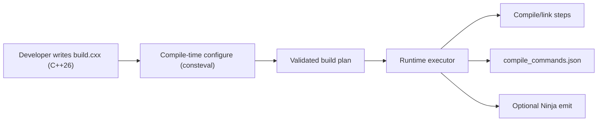
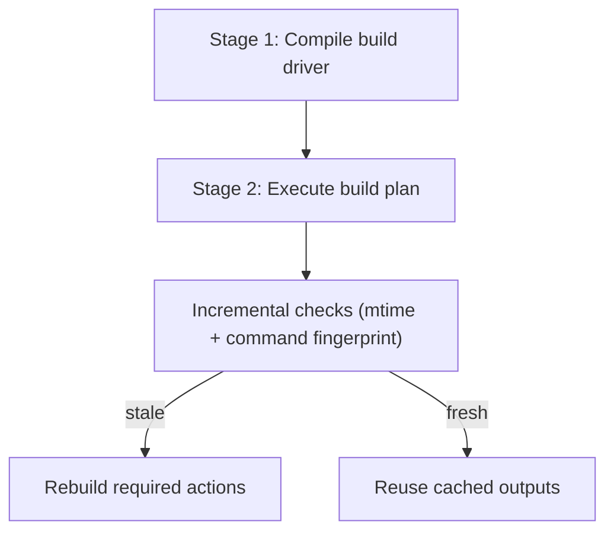
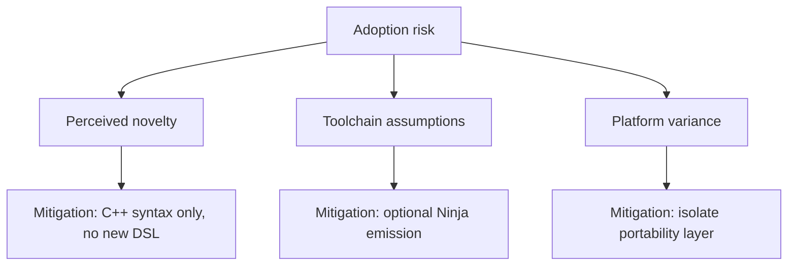

# build.cxx

<p align="center">
  
</p>

<p align="center">
  <strong>Proposal: native C++ build orchestration for low-error, low-overhead delivery</strong>
</p>

<p align="center">
  <a href="https://isocpp.org/"></a>
  <a href="license"></a>
</p>

---

## Executive objective

This project proposes a clean C++-only build system model designed for environments where reliability and developer throughput matter more than toolchain complexity. The primary use case is a professional proposal track toward iOS-oriented C++ workflows (including future C++32 alignment), with explicit focus on reducing mistakes while keeping runtime and conceptual overhead small.

### Design goals

1. Minimize configuration mistakes through compile-time validation.
2. Keep the user-facing model in one language (C++).
3. Preserve fast warm runs and low operational overhead.
4. Keep architecture clean enough for proposal-level review.

---

## Why this approach

Traditional stacks introduce semantic drift between application code and build code. `build.cxx` removes that split:

- Build declarations are C++ (`consteval`) and type-checked.
- Missing dependencies and invalid references fail at compile time.
- Runtime execution uses precomputed plans with incremental checks.

<div align="center">
  <em>Intent: fewer late CI surprises, fewer stringly-typed mistakes, smaller mental model.</em>
</div>

---

## System model



### Two-stage conceptual view



> Self-launching (`./build.cxx`) is currently a practical workaround for ergonomics and bootstrap simplicity. Conceptually, the architecture remains clean: compile-time planning + runtime execution.

---

## Proposal metrics and formal objective

Define:

- \( E \): expected build-configuration error rate.
- \( T_w \): warm-run latency.
- \( O_c \): cognitive overhead (number of languages and DSL constructs a user must master).

We optimize:

\[
\min J = \alpha E + \beta T_w + \gamma O_c, \quad \alpha,\beta,\gamma > 0
\]

Subject to:

\[
O_c \approx 1 \text{ language (C++)}, \quad T_w = O(\Delta)
\]

where \(\Delta\) is changed work only.

### Error-reduction argument (proof sketch)

1. Dependency and target names are validated during compilation.
2. Invalid references cannot produce a runnable build plan.
3. Therefore, a class of runtime misconfigurations is transformed into compile-time failures.
4. Compile-time failures are earlier, local, and easier to correct than CI-phase failures.
5. Hence expected late-stage error cost is reduced.

### Incremental-correctness argument (proof sketch)

A step is reused only if both conditions hold:

- Output newer than all inputs (mtime check).
- Exact command fingerprint unchanged.

Thus stale artifacts from flag changes or source changes are rejected. Cached reuse remains valid under the stated model.

---

## Risk graph



---

## Minimal usage example

```cpp
#include "build_cxx/build.hxx"

constexpr auto configure = []() consteval -> build::project {
    using namespace build;
    using enum standard;

    project p("myapp", { .major = 1, .minor = 0 });
    p.std(cpp26).release().werror();
    p.lib("core", { "src/core.cpp" }).inc("include");
    p.exe("app", { "src/main.cpp" }).dep("core");
    return p;
};

build::run<configure> app;
int main(int argc, char** argv) { return app(argc, argv); }
```

---

## CLI essentials

```bash
./build.cxx
./build.cxx --list
./build.cxx --target app
./build.cxx --why
./build.cxx --emit ninja
./build.cxx --run selftest
```

---

## Scope for iOS / C++32 proposal track

- Keep the model C++-native and auditable.
- Maintain tiny operational surface: one entry point, deterministic plan, explicit cache logic.
- Use generated compile DB for IDE and static analysis integration.
- Treat self-launching as transitional UX mechanics, not architectural coupling.

This positions `build.cxx` as a clean conceptual baseline for stricter platforms and future standards migration.

---

## Generated outputs

- `build/.bootstrap` — compiled build driver
- `build/compile_commands.json` — tooling integration
- `build/build.ninja` — optional backend export
- `build/.cache/*` — command fingerprint stamps
- `build/<target>` — produced artifacts

---

## License

Public domain. Use freely.
